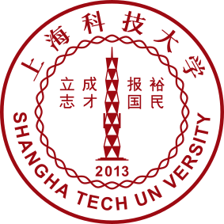

<h2 id="about-me">Short bio</h2>

Hello, I am Zhongyi Wang, a master student pursuing an M.Eng. in Computer Science and Engineering (2025.09 - present, expected 2028.06) at <a href="https://www.shanghaitech.edu.cn/eng/">ShanghaiTech University</a>, advised by <a href="https://faculty.sist.shanghaitech.edu.cn/faculty/wangjingya/">Prof. Jingya Wang</a>, jointly with <a href="https://shiye21.github.io/">Prof. Ye Shi</a> in Shanghai, China. Prior to this, I received my B.Eng. in Software Engineering from <a href="https://english.whut.edu.cn">WHUT</a> in 2025.

My research interests focus on <strong>robot learning</strong> and <strong>robotic foundation models</strong>, especially post-training for robotic foundation models and real-world robot learning systems.

  
  
  
  

<strong>Recent updates:</strong>

<ul>
  <li>2026.05 Two papers accepted by ICML 2026.</li>
  <li>2025.06 I graduate from WHUT as an outstanding graduate.</li>
</ul>





<!--  -->

<h2 id="honors-and-awards">Honors and Awards</h2>

<ul>
  <li>2025.06 <strong>Distinguished Undergraduate Thesis (Top 3%) / Outstanding Graduate</strong>, WHUT</li>
  <li>2024.11 <strong>National Scholarship</strong>, Chinese Ministry of Education, China</li>
  <li>2023.09 <strong>National First Prize</strong>, China Undergraduate Mathematical Contest in Modeling (CUMCM), China Society for Industrial and Applied Mathematics <a href="/assets/files/2023CUMCM.pdf" target="_blank">pdf</a></li>
</ul>

